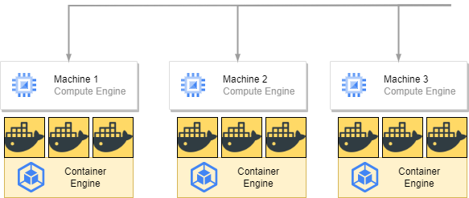

# Kubernetes Learning

---

## What's Kubernetes(K8S)?

> Container Manage Tool

The tool for overall Planning whole system, manage multi container

----

### Suitable for Large Scale System

Kubernetes is recommended **Project Manager,System Engineer**to learning

----

### Kubernetes is for multi-machine,multi-container as a premise

In the past we learned Docker has **Single Concrete Machine** Impaction
But Kubernetes is for **multi-machine**, and each concrete machine has lots of Container

Manage each container is very complicate then we have kubernetes.
For instance: If we have 20 Container then we need to deploy at least 20 times.

Even we apply Docker Compose .When Concrete Machine being messy it will also complicate.

Kubernetes can process **build,management...** in efficiency. Only need to write a manifest file then Kubernetes will follow content to build and management container in every concrete machine

---

## Master Node / Worker Node

Kubernetes is composed of **Master Node** and **Worker Node**

### Master Node 

Like a supervisor
It won,t execute container,only manage all the container from worker node

### Worker Node 

Like an employee
Container will run on it.As a result Worker must install Container Engine

### Cluster

Combination of Master Node and Worker Node called cluster.
cluster will run self-discipline(automated). The Manager only setup,alter Master Node at the beginning, manager won't manage worker node 

### Before use

Before we use Kubernetes we must install
1. Kubernetes
2. CNI(Container Network Interface)
    - flannel
    - Calico
    - AWS VPC CNI(Only for AWS)

Master Node must install **etcd** database for management statement

Worker Node must install **Container Engine** like Docker Engine

Manager Client Computer must install **kubectl** for setup Kubernetes

### Control Panel and Kube-let

Mater Node use Control Panel to manage Worker Node it involves 5 components
1. kube-apiserver
    - The pipeline with outside transfer, According kubectl executed
2. kube-controller-manager
    - Overall planning and execute controller
3. kube-scheduler
    - Distribute Pod to Worker Node
4. cloud-controller-manager
    - Build Service linkage with cloud service 
5. etcd 
    - Overall management data cluster database

Worker Node involves **kubelet,kube-proxy...components**

kube-let(embed in Kubernetes)
1. linkage Master Node and kube-scheduler
2. configure and execute in Worker Node

| kube-let                                                                                                                  | kube-proxy                      |
|---------------------------------------------------------------------------------------------------------------------------|---------------------------------|
| Linkage with kube-scheduler Distribute Pods in Worker Node,and monitor Pods Statement and notify kube-scheduler routinely | Network communication mechanism |

### Keep ideal statement

Kubernetes can create/delete container without enter command.Basically setup number of container and volume Kubernetes will keep it in ideal statement.

- Docker-Compose 
  - Build Container/Volume then abort
- Kubernetes
  - Build/Monitor/Maintain and keep in ideal statement

In summary when Kubernetes container has breakdown.Kubernetes will delete it automatically then rebuild a new container to keep in ideal statement

#### Can I force to delete Kubernetes Container is docker command?

Sure! but Kubernetes will rebuild a new container

---

## Kubernetes Construction