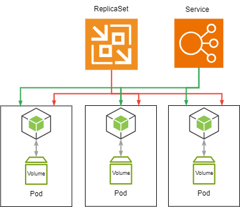

# Kubernetes Learning

---

## What's Kubernetes(K8S)?

> Container Manage Tool

The tool for overall Planning whole system, manage multi container

----

### Suitable for Large Scale System

Kubernetes is recommended **Project Manager,System Engineer**to learning

----

### Kubernetes is for multi-machine,multi-container as a premise

In the past we learned Docker has **Single Concrete Machine** Impaction
But Kubernetes is for **multi-machine**, and each concrete machine has lots of Container

Manage each container is very complicate then we have kubernetes.
For instance: If we have 20 Container then we need to deploy at least 20 times.

Even we apply Docker Compose .When Concrete Machine being messy it will also complicate.

Kubernetes can process **build,management...** in efficiency. Only need to write a manifest file then Kubernetes will follow content to build and management container in every concrete machine

---

## Master Node / Worker Node

Kubernetes is composed of **Master Node** and **Worker Node**

### Master Node 

Like a supervisor
It won,t execute container,only manage all the container from worker node

### Worker Node 

Like an employee
Container will run on it.As a result Worker must install Container Engine

### Cluster

Combination of Master Node and Worker Node called cluster.
cluster will run self-discipline(automated). The Manager only setup,alter Master Node at the beginning, manager won't manage worker node 

### Before use

Before we use Kubernetes we must install
1. Kubernetes
2. CNI(Container Network Interface)
    - flannel
    - Calico
    - AWS VPC CNI(Only for AWS)

Master Node must install **etcd** database for management statement

Worker Node must install **Container Engine** like Docker Engine

Manager Client Computer must install **kubectl** for setup Kubernetes

### Control Panel and Kube-let

Mater Node use Control Panel to manage Worker Node it involves 5 components
1. kube-apiserver
    - The pipeline with outside transfer, According kubectl executed
2. kube-controller-manager
    - Overall planning and execute controller
3. kube-scheduler
    - Distribute Pod to Worker Node
4. cloud-controller-manager
    - Build Service linkage with cloud service 
5. etcd 
    - Overall management data cluster database

Worker Node involves **kubelet,kube-proxy...components**

kube-let(embed in Kubernetes)
1. linkage Master Node and kube-scheduler
2. configure and execute in Worker Node

| kube-let                                                                                                                  | kube-proxy                      |
|---------------------------------------------------------------------------------------------------------------------------|---------------------------------|
| Linkage with kube-scheduler Distribute Pods in Worker Node,and monitor Pods Statement and notify kube-scheduler routinely | Network communication mechanism |

### Keep ideal statement

Kubernetes can create/delete container without enter command.Basically setup number of container and volume Kubernetes will keep it in ideal statement.

- Docker-Compose 
  - Build Container/Volume then abort
- Kubernetes
  - Build/Monitor/Maintain and keep in ideal statement

In summary when Kubernetes container has breakdown.Kubernetes will delete it automatically then rebuild a new container to keep in ideal statement

#### Can I force to delete Kubernetes Container is docker command?

Sure! but Kubernetes will rebuild a new container

---

## Kubernetes Construction 

> Pod Service Deployment ReplicaSet
> 

### Pod 

The management unit of Kubernetes is Pod.It is a pair of container and volume

Basically one pod has one container ,but it also can be multiple container

Like this 

The Volume of Pod can let multiple container use same information, so Pod usually not create Volume

### Service

Service overall manage Pod.

It manages lots of Pods also can manage just one Pod 

Even Pods are distributed in different concrete machine service also can manage them.

**Service's role is load-balancer** it will distribute them to fixed IP(Cluster IP) then access IP telecom.

However, Service only can process **Worker Node** telecom.About the distribution of Work Node should use **Load-Balancer or Ingress** need to prepare specify concrete machine or node.

### Deployment and ReplicaSet

ReplicaSet manage Pod's figure

When Pod is down.ReplicaSet will add Pods figure.When downsize definition of setting configuration it will also reduce the figure of pods

So Pods is managed by ReplicaSet and Service

So Pod also can call Replica

We seldom use ReplicaSet single usually we will also use Deployment together

Deployment manage Pod to configure and expanded

### Other resource of Kubernetes

| Resource Name          | Content                                  |
|------------------------|------------------------------------------|
| Pods                   | The pair of volume and Container         |
| podtemplates           | Pod template for deployment              |
| replicationcontrollers | Controller of Replica                    | 
| resourcequotas         | Restriction of Kubernetes resource usage |
| secrets                | Management of Key information            |
| serviceaccounts        | user of manager                          |
| services               | Manage of Access for Pod                 | 
| daemonsets             | build a Pod on each Worker Node          | 
| deployments            | Manage deployment of Pod                 |
| replicaSet             | Manage figure of Pod                     |
| statefulsets           | maintain state of pod deployment         |
| cronjobs               | schedule execute pod                     |
| jobs                   | execute pod ones                         |

---

## Installation and usage of Kubernetes

Kubernetes is an opensource software.Its standard formulate by **Cloud Native Computing Foundation, CNCF**

CNCF has their own Kubernetes also third-party Kubernetes according CNFC formulation to create their own Kubernetes

Google Cloud Platform,AWS,Azure offer cloud version of customize Kubernetes.

This kind of Kubernetes is compatible with each other. Official list all the Kubernetes which obtain **Certified Kubernetes** certificate and compatible software.

### Kubernetes Desktop and Minikube save your soul

It's hard for beginner to try Kubernetes.So Docker Desktop bundle Kubernetes.We only need to check **Kubernetes** that we can use Kubernetes and don't need to install **etcd CNI...** dependencies.

So how about linux system? Linux's system can use simple version of Kubernetes **Minikube**

#### Minikube(Linux)

Kubernetes is for **Large Scale System** it needs lots of concrete machine setup **Master Node** and **Worker Node**

Minikube can setup **Master Node** and **Worker Node** in one concrete machine

we don't need to prepare anymore concrete machine that is really convenient!!

#### Docker Desktop Kubernetes(MacOS and Windows)
##### Step.1 Enable Kubernetes

In setting panel check **Enable Kubernetes**

##### Step.2 Install Kubernetes

If it has prompt on your window please click **Install** button

##### Step.3 Activate Kubernetes

Wait Kubernetes icon which located in bottom navigation turn green. 

#### Supplement Concrete machine Kubernetes construction and kubeadm

How to operate construct production of Kubernetes on multiple concrete machine?

If we want to use production of Kubernetes

1. must prepare sufficient figure of concrete machine or virtual machine (Worker Node + Master Node) then carry with Ubuntu/Linux... OS.
2. Then install Kubernetes/CNI/etcd on **Master Node**
3. Install Container engine/Kubernetes/CNI on **Worker Node**

The following step of construction we can through **kubeadm** to help us.

Finally, what **Master Node and Worker Node** is response for.
- Master Node use **kubeadm init**
- Worker Node use **kubead** that we can connect with Master Node

Also, you can use other tool like **conjure-up** **Tectonic**

---

## Definition file(list file) format

### What is definition file(list file)

Kubernetes will follow definition file(list file) content to build **Pod**.Make definition file upload to Kubernetes.**Ideal statement** will write in database(etcd).

#### Coding definition file by Yaml

Pod,Server.etc.. configuration called **manifest** in Kubernetes

It is difference with Docker Compose, Kubernetes definition file has no restriction in naming.

| Name                   | Content |
|------------------------|---------|
| Definition File Format | YAML    | 
| Definition File Name   | Any     |

#### In terms of resource write definition file content

In definition file we don't write Pod. Why our target is build Pod but haven't pod.Because when Kubernetes build Pod by Pod it won't maintain its pod figure.

These kinds of feature are managed by **ReplicaSet and Deployment** So we need to write **ReplicaSet and Deployment**, and when we write **Deployment** it also involves of **ReplicaSet**, So we only need to write **Deployment**

In summary if we want to build **Apache Pod** only need to write **Apache Deployment** and **Apache Service**.

#### Definition File Separate

Definition file can accord resource type to separate file.

### Definition Inputs

Kubernetes definition file divide into four part

| part         | content                |
|--------------|------------------------|
| apiVersion:  | API Group and Version  | 
| kind:        | Resource kind          | 
| metadata:    | Resource description   | 
| spec:        | Resource Content       | 

#### Specify resource (API group and type)

When we specify resource need to enter API group (API Version) and kind

##### General Resource API Group and Version

| Resource   | API Group/Version | Kind          |
|------------|-------------------|---------------|
| Pod        | core/v1 (or v1)   | Pod           |
| Service    | core/v1 (or v1)   | Service       |
| Deployment | apps/v1           | Deployment    |
| ReplicaSet | apps/v1           | ReplicaSet    |

#### Metadata and Spec

Metadata involve
- Resource name
- Resource Label

Spec is resource content

##### Major Metadata

| Item               | Content                                                   |
|--------------------|-----------------------------------------------------------|
| name               | resource name                                             | 
| namespace          | DNS compatibility tags to further break down resources    |
| uid                | unique id                                                 | 
| resourceVersion    | resource Version                                          | 
| generation         | Create sequence id                                        |
| creationTimestamp  | create time                                               | 
| deletionTimestamp  | delete stamp                                              |
| labels             | any label                                                 |
| annotation         | resource setting value                                    |

#### Label and Selector

Pod and Service can add any label

Label is a pair of key and value,Presented in the form of metadata.

After we added label we can through selector to filter Pod/Service.

### Metadata and Spec format(1) Pod

